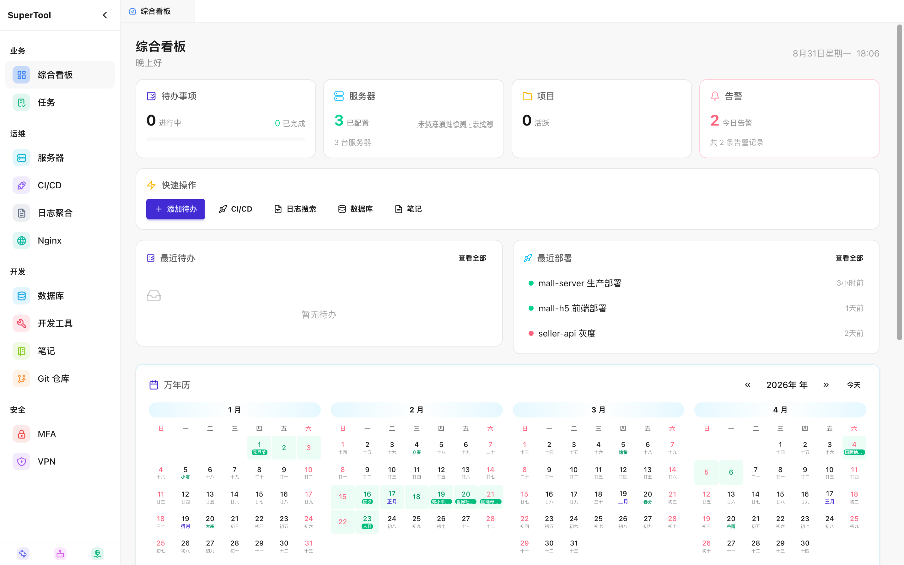
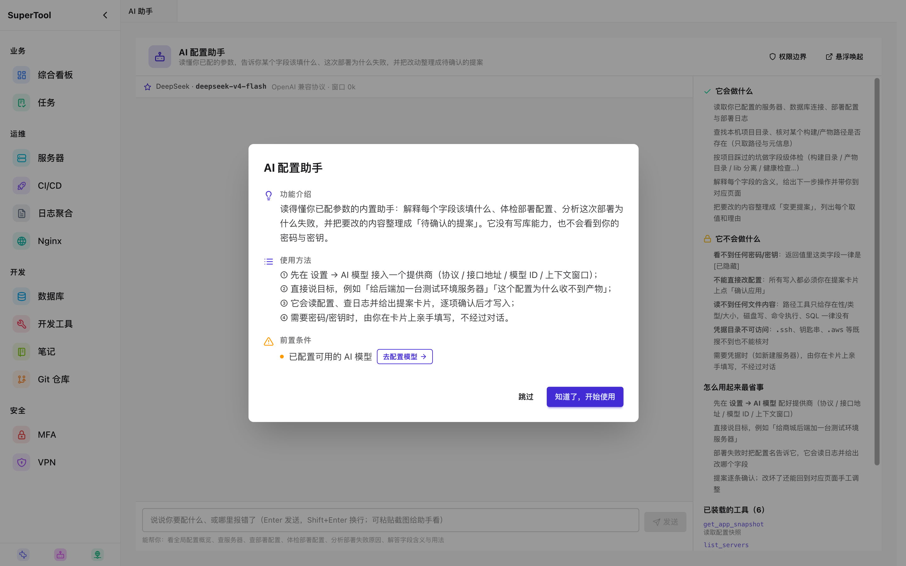
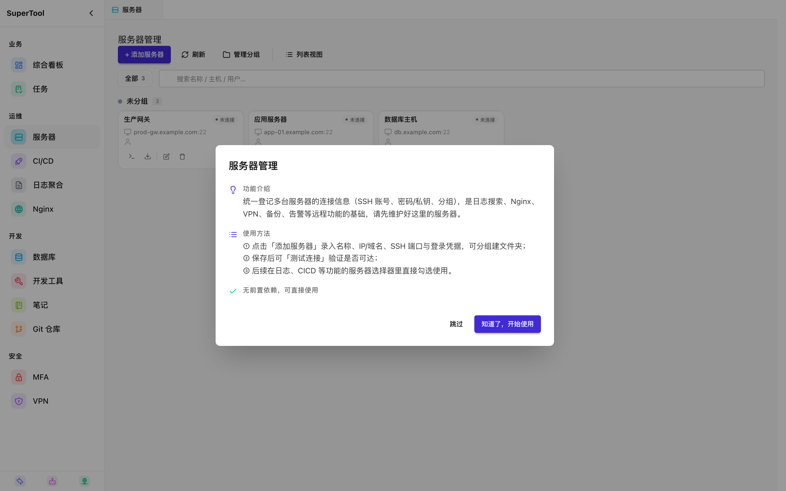
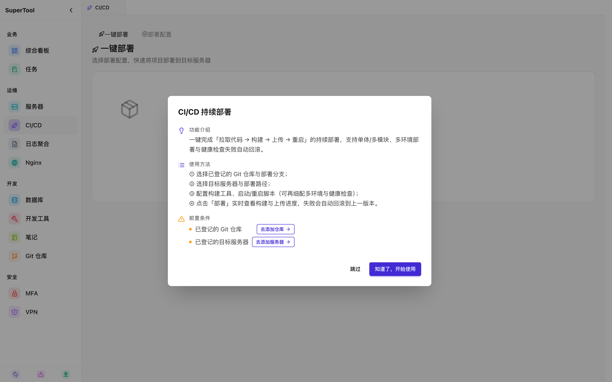
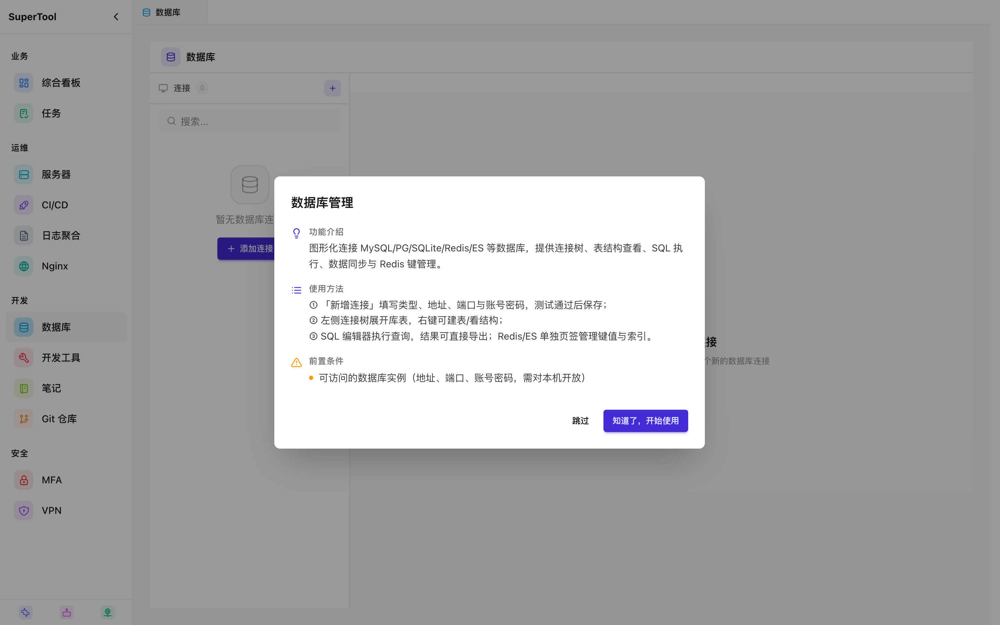
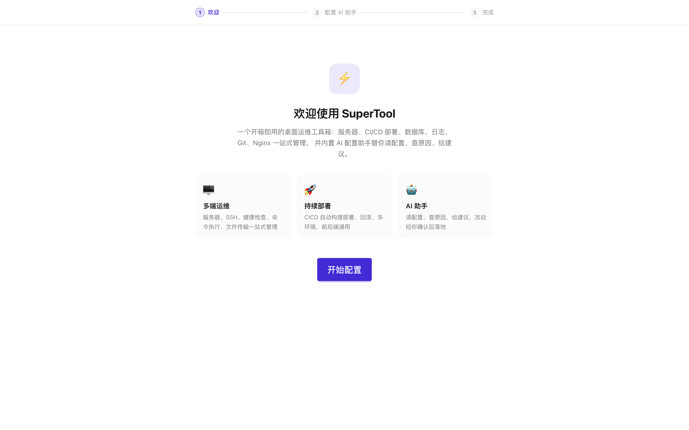
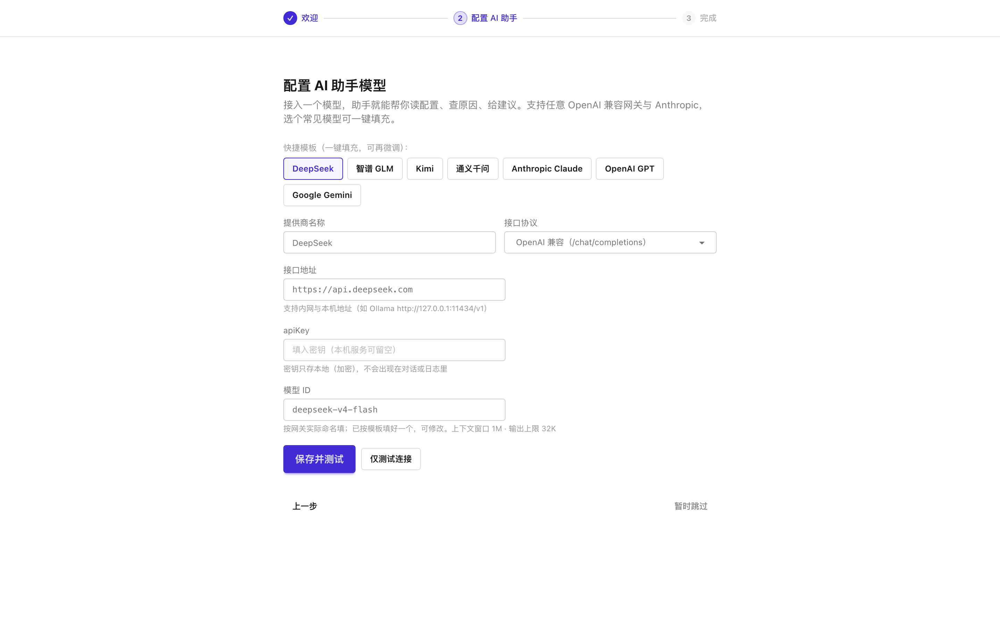
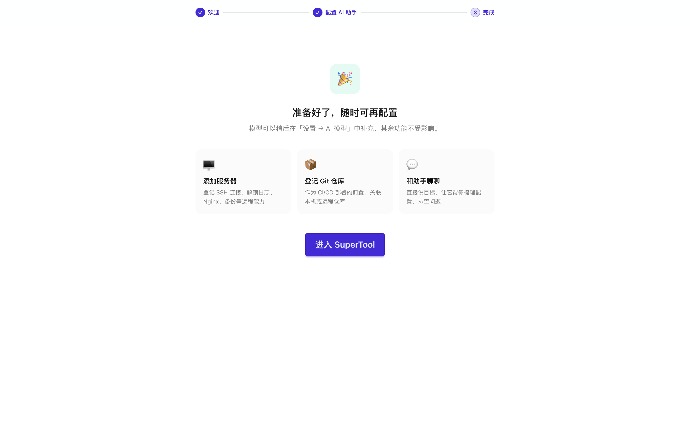

# SuperTool

[中文文档](README_CN.md) | **English**

Cross-platform desktop operations management tool — built on Tauri v2 + Vue 3 + Rust shared library architecture, unifying server management, CI/CD deployment, databases, logs, Git repositories, and **AI Agent integration**.

## Screenshots

<p align="center">
  
  
</p>
<p align="center">
  
  
</p>
<p align="center">
  
</p>

**First-run Onboarding** — a full-screen wizard that walks you through connecting your AI model on first launch, so the assistant is ready in minutes:

<p align="center">
  
  
  
</p>

## Features

### Core Operations

- **Todo Management**: Personal todo list with priorities, due dates, subtasks, and weekly reports (homepage)
- **Project Management**: Multi-project tracking with Git integration and deployment history
- **Server Management**: SSH connections, health checks, command execution, file operations
- **Database Management**: Direct query/edit MySQL, PostgreSQL, Redis with connection presets
- **CI/CD Deployment**: Automated build/deploy pipelines, rollback, history tracking
- **Log Aggregation**: Multi-server log search, real-time tail, preset configurations
- **Git Management**: Repository status, commit history, branch management
- **Nginx Management**: Config presets, pull/test/deploy across servers
- **VPN Management**: OpenVPN/WireGuard tunnel management, intranet穿透

### Personal Tools

- **Notes**: Note-taking with grouping and search
- **Accounting**: Income/expense tracking, categories, budgets, statistics
- **MFA**: TOTP authenticator, generate verification codes
- **Weekly Report**: Auto-generate from todo completions and project commits
- **Disk Cleaner**: Find and clean large files, old logs, cache directories
- **Data Backup**: Export/import all data (SQLite + configs)

### AI Agent

- **Hermes Chat**: Built-in AI assistant with streaming responses, tool call visualization
- **Real-time Task Panel**: Right sidebar shows todo progress during AI execution
- **File Attachment**: Select files/folders/Git repos to attach to conversations
- **Session Management**: Multi-session, title editing, export, search

### Infrastructure

- **Alert Management**: Configure and view system alerts
- **LAN Discovery**: Auto-discover servers in local network
- **DevTools**: Debug utilities, API testing, serial tools
- **Settings**: Application configuration, theme switching, language selection

### Architecture Highlights

- **Unified Architecture**: `core` / `cli` / `tauri` three-crate workspace, all business logic in `supertool-core`
- **Standalone CLI**: `stool` CLI (~12MB) directly links core, deployable on servers without GUI
- **Modern Frontend**: Vue 3 + TypeScript + Tailwind CSS v4 + daisyUI
- **Internationalization**: Chinese / English
- **Encrypted Storage**: AES-256-GCM for SSH passwords, DB passwords

## Architecture

```
supertool/
├── core/          # supertool-core shared library (single source of truth)
│   └── src/
│       ├── db/         # SQLite data access layer
│       ├── encryption/ # AES-256-GCM encryption
│       └── logic/      # Business logic: ssh, cicd, git, openvpn, wireguard, nginx...
├── cli/           # stool CLI (direct core access, standalone)
│   └── src/
│       ├── main.rs       # clap CLI entry point
│       ├── commands/     # All subcommands (todo, server, cicd, db, log, git)
│       ├── runtime.rs    # CliRuntime lifecycle management
│       └── types.rs      # CLI type definitions
├── tauri/         # Tauri GUI (also direct core access)
│   ├── src/            # Rust IPC command layer
│   ├── tauri.conf.json # Tauri config
│   └── ...
└── src/           # Vue 3 frontend
    ├── views/          # Page components
    ├── components/     # Reusable components
    └── ...
```

### Data Flow

```
stool CLI ──┐
            ├──▶ supertool-core (CoreService) ──▶ SQLite / SSH / MySQL / Redis / ...
Tauri GUI ──┘
```

Both CLI and GUI directly link to `supertool-core`, **zero UDS/HTTP middleware**.

## Quick Start

### Prerequisites

- [Node.js](https://nodejs.org/) (v18+) + [pnpm](https://pnpm.io/)
- [Rust](https://rustup.rs/) toolchain (edition 2024)

### Installation

```bash
git clone git@github.com:fufengyuan/supertool.git
cd supertool
pnpm install
```

### Development

```bash
# Start Tauri development environment (frontend + backend)
pnpm tauri dev

# Build CLI standalone (output cli/target/release/stool, ~12MB)
cd cli && cargo build --release

# Production build
pnpm tauri build
```

## Development Commands

### Frontend

```bash
pnpm dev          # Vue dev server (port 1420)
pnpm build        # Production build
pnpm preview      # Preview production build
```

### Tauri

```bash
pnpm tauri dev    # Development environment
pnpm tauri build  # Production build
pnpm tauri        # Tauri CLI
```

### Rust / CLI

```bash
# Full workspace compilation check
cargo check --workspace

# CLI release build
cd cli && cargo build --release

# Tauri release build
cd tauri && cargo build --release
```

### Code Quality

```bash
pnpm lint         # oxlint
pnpm lint:fix     # oxlint --fix
pnpm format       # Prettier
vue-tsc --noEmit  # TypeScript type checking
```

## Git Commit Convention (Auto Versioning)

Follows **Conventional Commits** with automatic version bumping:

| Commit Type | Version Change | Description |
|-------------|----------------|-------------|
| `feat:` | minor (+0.1.0) | New feature |
| `fix:` | patch (+0.0.1) | Bug fix |
| `feat!:` or `BREAKING CHANGE` | major (+1.0.0) | Breaking change |
| `chore:`, `docs:`, `style:` | No change | Maintenance commits |

**Examples**:
```bash
git commit -m "feat: add user authentication"    # 4.3.0 → 4.4.0
git commit -m "fix: resolve login timeout"       # 4.4.0 → 4.4.1
git commit -m "feat!: redesign API structure"    # 4.4.1 → 5.0.0
git commit -m "chore: update dependencies"       # No version change
```

**Files Updated (4 locations)**:
- `package.json`
- `cli/Cargo.toml`
- `core/Cargo.toml`
- `tauri/Cargo.toml`

**Mechanism**:
- Git hooks in `scripts/hooks/`
- Auto-configured on `pnpm install` (postinstall)
- New clone: run `./scripts/init-hooks.sh` or `pnpm install`

## Project Structure

```
supertool/
├── Cargo.toml              # Workspace config (core, cli, tauri)
├── core/                   # supertool-core shared library
│   ├── Cargo.toml          # version = "4.2.0", edition = "2024"
│   └── src/
│       ├── lib.rs              # Library entry
│       ├── service.rs          # CoreService main entry
│       ├── db/                 # SQLite data access
│       │   ├── database.rs         # Main database operations
│       │   ├── servers.rs          # Server CRUD
│       │   ├── cicd.rs             # CI/CD config
│       │   ├── projects.rs         # Project management
│       │   ├── openvpn.rs          # OpenVPN config
│       │   ├── wireguard.rs        # WireGuard config
│       │   └── lan.rs              # LAN discovery
│       ├── encryption/         # AES-256-GCM encryption
│       └── logic/              # Business logic
│           ├── data_dir.rs         # Data directory resolution
│           ├── ssh.rs              # SSH connection management
│           ├── cicd_deploy.rs      # Deployment engine
│           ├── git.rs              # Git operations
│           ├── openvpn.rs          # OpenVPN tunnel
│           ├── wireguard.rs        # WireGuard tunnel
│           ├── nginx.rs            # Nginx config
│           └── log_sanitizer.rs    # Log sanitization
├── cli/                    # stool CLI
│   ├── Cargo.toml          # version = "4.2.0"
│   └── src/
│       ├── main.rs             # Entry + command registration
│       ├── commands/           # todo, server, cicd, db, log, git
│       ├── runtime.rs          # CliRuntime
│       ├── types.rs            # clap type definitions
│       ├── output.rs           # Output formatting
│       ├── utils.rs            # Utility functions
│       └── guide.rs            # Usage guide
├── tauri/                  # Tauri GUI
│   ├── Cargo.toml          # version = "4.2.0"
│   ├── tauri.conf.json     # Tauri config
│   └── src/
│       ├── main.rs             # Tauri entry
│       ├── lib.rs              # Tauri command library
│       └── commands/           # IPC commands
└── src/                    # Vue 3 frontend
    ├── main.ts             # Vue entry
    ├── App.vue
    ├── router/             # Router config
    ├── views/              # Pages
    ├── components/         # Components
    ├── layouts/            # Layouts
    ├── stores/             # Pinia stores
    ├── utils/              # Utilities
    ├── locales/            # i18n (zh-CN, en-US)
    └── assets/             # Static assets
```

## Technology Stack

### Rust Backend

- **Rust** edition 2024
- **Tauri v2** — Cross-platform desktop framework
- **rusqlite** — SQLite embedded database
- **mysql_async** / **tokio-postgres** — External database connections
- **redis** — Redis client
- **ssh2** — SSH connection management
- **aes-gcm** — AES-256-GCM encryption
- **tokio** — Async runtime

### Frontend

- **Vue 3** — Composition API + `<script setup>`
- **TypeScript** — Strict mode
- **Vite** — Build tool
- **Tailwind CSS v4** + **daisyUI** — Styling
- **Pinia** — State management
- **Vue i18n** — Internationalization
- **Vue Router** — Routing
- **pnpm** — Package manager

### Development Tools

- **oxlint** — Fast linting
- **Prettier** — Code formatting
- **vue-tsc** — TS type checking

## Data Directory

All runtime data stored in `~/.supertool/`:

```
~/.supertool/
├── supertool.db        # SQLite main database
├── logs/               # Application logs
├── tmp/                # Temporary files
├── backups/            # Backup files
├── cicd/               # CI/CD deployment artifacts
└── cli/                # CLI binary (auto-installed to /usr/local/bin/)
```

Customizable via `~/.supertool_dir` file.

## CLI Usage

The CLI is an AI Agent operations tool with 15+ commands covering all features. See [skills/stool-cli/SKILL.md](skills/stool-cli/SKILL.md) for details.

```bash
stool version                 # Check version

# Todo & Project
stool todo list               # Todo list
stool todo add "Task name"    # Add todo
stool subtask list <todo_id>  # Subtasks
stool project list            # Projects

# Server & Database
stool server list -j          # Server list (JSON)
stool server health <id>      # Health check
stool db query -d <id> "SQL"  # Database query
stool db list                 # Database connections

# CI/CD & Git
stool cicd deploy <id> --stream  # Deploy with streaming
stool cicd rollback <id>         # Rollback
stool git status <repo_id>       # Git status

# Logs & Nginx
stool log search <preset> "ERROR" -l 30  # Log search
stool nginx pull <preset>               # Pull nginx config

# Personal Tools
stool note list               # Notes
stool accounting list         # Accounting records
stool mfa list                # MFA keys
stool mfa code <id>           # Generate TOTP code
stool weekly generate         # Generate weekly report
stool backup export           # Export all data
```

## Contributing

1. Fork the repository
2. Create a branch: `git checkout -b feature/xxx`
3. Commit changes: `git commit -m 'feat: xxx'`
4. Push: `git push origin feature/xxx`
5. Open a Pull Request

## License

MIT License — see [LICENSE](LICENSE)
